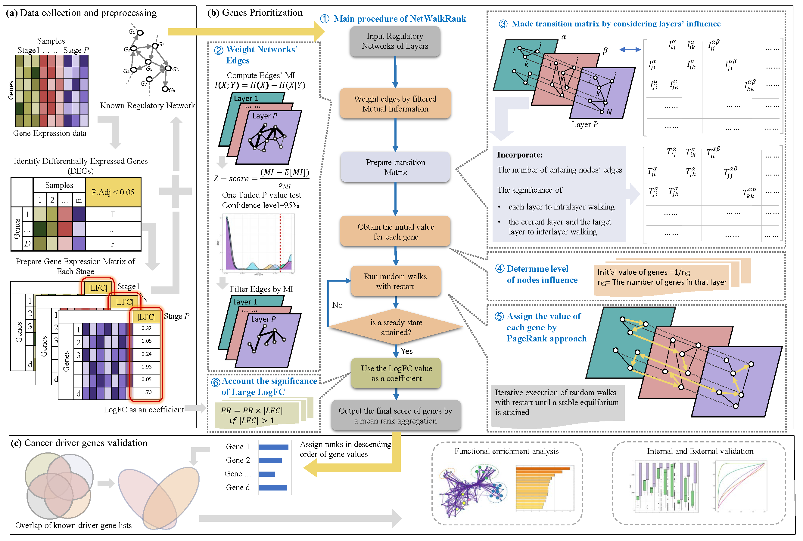

# [NetWalkRank: Cancer driver gene prioritization in multiplex gene regulatory networks by a random walk approach](https://github.com/zpliulab/NetWalkRank)

## Highlights
- A method to prioritize cancer driver genes in multistep gene regulatory networks.
- A network propagation concept is applied to calculate each gene’s impact in spreading abnormality.
- The performance of method was demonstrated through the classifications assigned to the cancer driver genes.

If you have any questions about NetWalkRank, please directly contact the corresponding author Prof. Zhi-Ping Liu with the E-mail: zpliu@sdu.edu.cn

## Data
In the Data directory, we only give some necessary files by each R program.
Some of these input files only give the first few lines, but this does not affect the results of the work (NetWalkRank).

## R code for NetWalkRank
The serial number (1) (2) ... (9) represents the order in which the program runs in our work.
- (1) DEG_Limma.R ------- Processing original data of GSE89377.
- (2) MI_Computation.R ------- Computing mutual information between genes in each layer to weight the connections.
- (3) Layer_Preparation.R ------- Filter the edges based on mutual information higher than a threshold.
- (4) REGmlwpFC.R ------- Calculate the nodes' scores.
- (5) FeatureSelection.R ------- Select features and machine learning method according to genes' scores.
- (6) MachineLearningResults.R ------- Calculate sensivity, specificity, accuracy and etc. by random forest on the genes' scores.
- (7) PlotCompareDriverNonDriver.R ------- Plot results of compare ranks for driver and non-driver genes after using the method.
- (8) PlotRankOfDriverGenesInStrategies.R ------- Plot results of ranks for driver genes in different strategies.
- (9) PlotDifferentStrategies.R ------- Plot ROC curve and boxplot of AUC in different strategies.

## Other Code
We compare our method with the other methods. Also, we compare results of using different protein-protein networks in our method.
OtherCode directory contains code to plot the comparision results.

## Citation:
F. Keikha, L. Li, W. -K. Ching and Z. -P. Liu, "NetWalkRank: Cancer Driver Gene Prioritization in Multiplex Gene Regulatory Networks by a Random Walk Approach," in IEEE Transactions on Computational Biology and Bioinformatics, vol. 22, no. 4, pp. 1875-1887, July-Aug. 2025, doi: 10.1109/TCBBIO.2025.3573742. 

